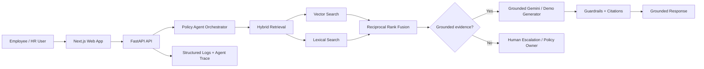

# Gulf Horizon Bank — Bilingual Enterprise AI Assistant

A production-oriented Arabic/English RAG system for a fictional GCC bank. The project demonstrates how an enterprise assistant can retrieve approved internal policy, generate grounded answers with citations, reject unsupported requests, and expose enough evaluation and observability to be trusted beyond a basic LLM demo.

The current engineering focus is the full GenAI lifecycle: **retrieval → orchestration → grounded generation → evaluation → safe fallback → deployment**.

> **Portfolio purpose:** demonstrate applied AI engineering across Python/FastAPI, RAG, hybrid retrieval, orchestration patterns, evaluation, responsible-AI guardrails, testing, Docker, and a realistic Google Cloud production path.

## Why this problem matters

Employees in regulated organizations often search across policy PDFs, shared drives, and email threads for operational answers. A generic chatbot can answer quickly but may invent policy. This prototype instead treats enterprise knowledge as an evidence problem:

- retrieve only approved internal policy
- answer in Arabic or English
- cite the evidence supporting each policy claim
- refuse or escalate when evidence is insufficient
- treat retrieved text as untrusted data to reduce prompt-injection risk
- measure retrieval, grounding, citation, language, and latency behavior

## What is implemented

### GenAI / RAG
- bilingual Arabic/English question answering
- document ingestion, chunking, metadata, and embeddings
- semantic vector retrieval
- **hybrid retrieval using semantic + lexical search with Reciprocal Rank Fusion (RRF)** in local mode
- grounded generation with inline `[S#]` citations
- conversation context
- unsupported-question refusal

### Agentic orchestration pattern
The assistant uses an explicit deterministic tool-routing layer rather than claiming to be a fully autonomous multi-agent system. Each request follows an auditable sequence:

1. select the `policy_search` tool
2. run hybrid retrieval against approved policy
3. inspect whether evidence clears the grounding threshold
4. route to grounded generation when evidence is sufficient
5. route to `human_escalation` when evidence is insufficient
6. log the orchestration trace for observability

This demonstrates tool selection, orchestration, safe fallback, and human-in-the-loop escalation while keeping the behavior explainable.

### Responsible AI / security
- answer only from approved policy context
- prompt-injection resistance in system instructions
- no invented policy when context is insufficient
- source provenance returned to the user
- deterministic human-escalation path
- local demo mode contains no cloud credentials
- private-backend + IAP production design

### Engineering
- Python / FastAPI backend
- Next.js frontend
- REST API surface
- Docker Compose
- structured request logging
- automated backend tests
- evaluation harness
- Google Cloud production path using Gemini + BigQuery Vector Search

## Architecture



### Production path

```text
User
  ↓
IAP-protected web tier
  ↓
Private FastAPI service on Cloud Run
  ↓
Policy orchestration
  ↓
Approved document retrieval
  ├─ BigQuery Vector Search
  └─ lexical/hybrid retrieval extension
  ↓
Gemini generation
  ↓
Grounding / citation / policy guardrails
  ↓
Response + structured observability
```

## Verified baseline results

Verified in the local demo environment on 12 August 2026:

- **5/5 backend tests passed**
- **8/8 evaluation cases passed**
- retrieval hit@k: **1.0**
- citation rate: **1.0**
- grounding decision accuracy: **1.0**
- language match rate: **1.0**
- grounded keyword coverage: **1.0**

The Bain-focused upgrade adds a regression test for hybrid retrieval. Updated metrics should be published only after the branch CI/test run is verified.

## Evaluation

The evaluation harness measures:

- retrieval hit@k
- citation behavior
- grounded vs unsupported decision accuracy
- Arabic/English language matching
- required-keyword coverage
- latency

The goal is not merely to demonstrate that an LLM can answer a question, but to make failure modes measurable and repeatable.

```bash
cd backend
PYTHONPATH=backend pytest -q backend/tests
python scripts/evaluate.py ../evaluation/eval_set.json
```

## Quick start

### Docker Compose

```bash
cp .env.example .env
docker compose up --build
```

Then open:

- Frontend: `http://localhost:3000`
- FastAPI docs: `http://localhost:8080/docs`

Demo credentials:

```text
employee@gulfhorizon.local
Demo123!
```

## Demo scenarios

1. Ask an approved remote-work or cybersecurity policy question.
2. Verify that the answer cites retrieved evidence.
3. Ask the same question in Arabic and verify language matching.
4. Try an adversarial instruction such as asking the assistant to ignore policy.
5. Ask an unsupported policy question and verify that the system refuses to invent an answer and routes toward human escalation.

## Local demo vs cloud production

### Local mode
- zero-cost deterministic generation
- local hash embeddings
- persisted local vector index
- hybrid vector + lexical retrieval
- no cloud credentials required

### Google Cloud path
- Gemini generation
- Gemini embeddings
- BigQuery Vector Search
- Cloud Run
- IAP-protected web tier
- Secret Manager / Audit Logs hardening path

The local mode is deliberately labelled as a demo and is not presented as live Gemini inference.

## API surface

- `GET /health`
- `POST /api/auth/login`
- `POST /api/chat`
- `GET /api/conversations/{conversation_id}`
- `POST /api/ingest`
- `GET /api/documents`
- `POST /api/evaluate`

## Repository structure

```text
.
├── backend/
│   ├── app/
│   │   ├── api/
│   │   ├── services/
│   │   │   ├── agent.py
│   │   │   ├── rag.py
│   │   │   ├── evaluation.py
│   │   │   └── generation.py
│   │   └── stores/
│   └── tests/
├── frontend/
├── evaluation/
├── sample_data/
├── docs/
├── infra/
└── docker-compose.yml
```

## Engineering decisions I can defend in an interview

**Why RAG instead of relying on model memory?** Enterprise policy needs evidence, updateability, and citations.

**Why hybrid retrieval?** Semantic retrieval handles paraphrases; lexical retrieval protects exact policy terms, numbers, names, and domain vocabulary. RRF combines the rankings without pretending their raw scores are directly comparable.

**Why deterministic orchestration?** For a regulated-policy assistant, a small explicit tool graph is easier to test, audit, and constrain than unnecessary autonomous behavior.

**Why human escalation?** When evidence is insufficient, the correct product behavior is not a more creative prompt—it is a safe handoff.

**Why evaluation?** A GenAI application needs regression checks for retrieval, grounding, citations, language behavior, and latency, not only anecdotal demos.

## Current limitations

- fictional and intentionally small policy corpus
- retrieval-time document ACL enforcement is not yet implemented
- conversation persistence is not yet an enterprise-grade secure store
- cloud production configuration must be validated in the target environment
- the orchestration layer demonstrates agentic patterns but is **not** presented as a fully autonomous multi-agent platform

## Next engineering steps

- production-grade BM25 / managed lexical retrieval
- reranking over hybrid candidates
- larger multilingual golden evaluation set
- automated groundedness / faithfulness scoring
- retrieval regression gates in CI
- role-aware document ACLs
- explicit approval workflows for high-risk actions
- tool/function-calling integrations for approved enterprise workflows

## Screenshots


## Portfolio summary

Built a bilingual enterprise GenAI assistant that combines RAG, hybrid retrieval, explicit orchestration, grounded generation, evaluation, responsible-AI fallbacks, REST APIs, and a realistic Google Cloud production architecture. The system is designed around a regulated-enterprise question: **how do you make an LLM useful without allowing it to invent policy?**
