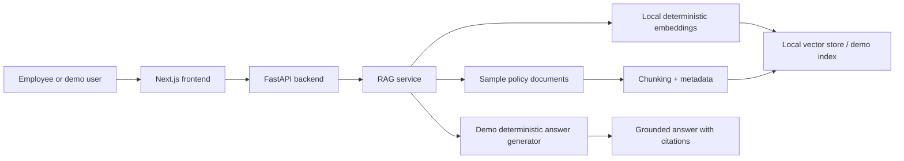
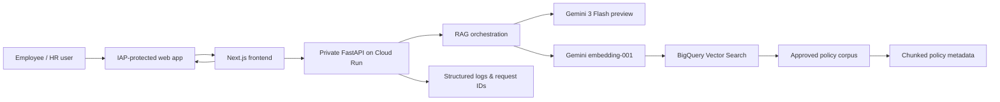

# Architecture

## Local demo architecture

## Production Google Cloud architecture

## Component responsibilities

| Component | Responsibility |
|---|---|
| Next.js frontend | UI, demo experience, citation display, auth flow |
| FastAPI backend | orchestration, ingestion, evaluation, retrieval, grounded prompt construction |
| Local demo vector store | zero-cost fallback for local testing and portfolio demos |
| BigQuery Vector Search | production retrieval over approved policy chunks |
| Gemini 3 Flash preview | answer generation grounded in retrieved context |
| Gemini embedding-001 | embedding generation for policy text and queries |
| Sample policy corpus | local deterministic test data for bilingual policy questions |

## Request flow

1. User submits query in Arabic or English.
2. Frontend sends request to the backend API.
3. Backend checks auth and request context.
4. Retrieval logic builds the safe query and fetches relevant chunks.
5. Prompt is grounded with approved sources only.
6. Generation model produces a response with citations.
7. Frontend renders the answer and sources.

## Ingestion flow

1. Approved policy document is uploaded or ingested via the admin path.
2. The system reads file content and metadata.
3. Chunking splits the document into policy-relevant segments.
4. Embeddings are generated for each chunk.
5. Chunks are stored in the configured vector backend.
6. Retrieval uses the approved corpus for future question answering.

## Trust boundaries

- Local demo boundaries: no cloud identity or external service dependency.
- Production boundaries: Cloud Run backend remains private; web tier is protected by IAP.
- Retrieval boundaries: approved documents only; no general web search.
- Prompt boundary: retrieved content is treated as untrusted data, not instructions.

## BigQuery Vector Search decision and alternatives

### Why BigQuery Vector Search was chosen

- direct SQL inspection of retrieval mechanics
- governance alignment with enterprise data in BigQuery
- customer-friendly discussion of data ownership, cost, and controls
- replaceable vector-store abstraction in the codebase

### Alternatives considered

- managed RAG tooling for lower operational burden
- dedicated vector databases for specialized performance or filtering patterns

This repository intentionally keeps the vector-store abstraction replaceable so the customer can compare options without redesigning the product.
